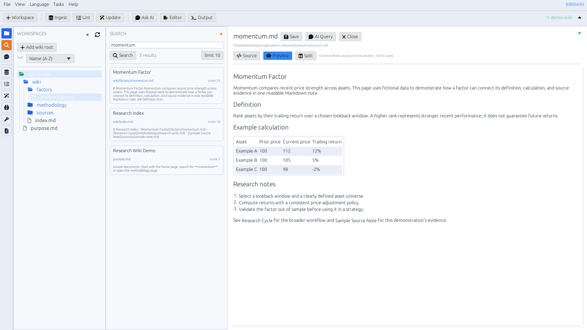
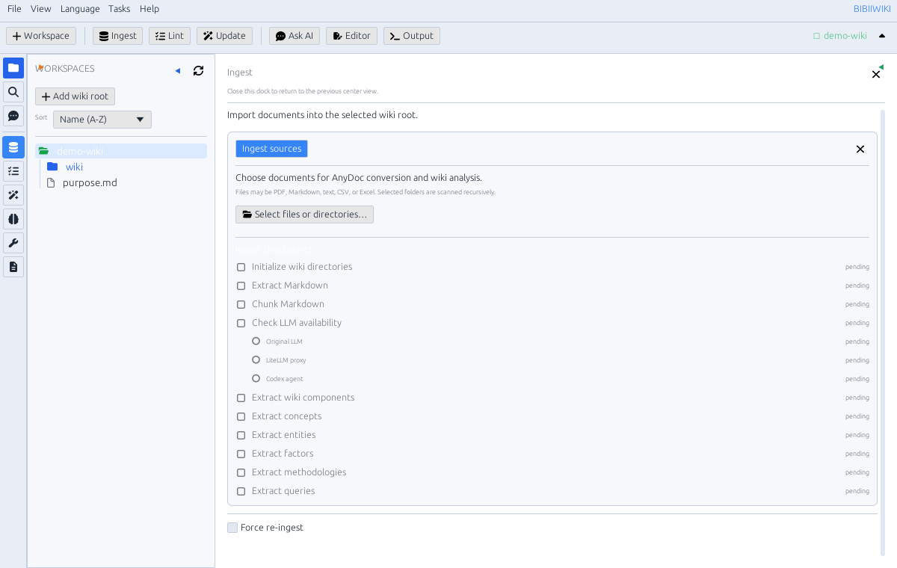

# BIBIIWIKI

把散落的文档，变成能搜索、能追溯、能持续生长的 Markdown 知识库。

BIBIIWIKI 是面向研究与知识整理的桌面工作台。导入资料后，你可以在同一个界面浏览原文、阅读转换后的 Markdown、整理概念与方法、查找证据，并围绕自己的知识库提问。文件保存在你选择的本地目录中，不会被锁进专有数据库。



> 截图使用仓库中的合成演示资料，不包含私人文档。

## 为什么用 BIBIIWIKI？

- **资料有来处。** 原始文件与转换后的 Markdown 分开保存，生成的知识页可以保留来源线索，方便回看与核对。
- **阅读与整理在一起。** 文件树、全文搜索、Markdown 源码/预览/分栏和 AI 问答共处一个可调整布局的工作区。
- **知识是你的文件。** 使用普通 Markdown 与 YAML；可以用 Git 版本管理，也可以继续用你喜欢的编辑器查看和修改。
- **从中断处继续。** 大批量导入显示文件、分块和知识提取进度；任务失败后可继续，也可以选择重做。
- **搜索不必等 AI。** 本地搜索和 Markdown 编辑无需调用模型；需要语义整理或问答时，再接入本地或远程模型。

## 从文档到可用的知识

1. **导入资料**：选择文件或文件夹。支持 Markdown、文本、CSV、PDF，以及 AnyDoc 支持的常见 Office 文档。原件保留在 `raw/sources`，转换后的内容进入 `wiki/sources`。
2. **整理知识**：按 Markdown 结构分块，借助配置好的模型提取概念、实体、因子与方法论；每一步的状态和输出都可查看。
3. **查找与提问**：在整个 wiki 中搜索关键词，打开命中的笔记；需要综合回答时，可让 AI 依据选中的知识库证据作答。
4. **继续维护**：编辑页面、检查链接和元数据，更新索引，让资料和知识页随着研究一起演进。



## 适合这些工作

- 把论文、报告和笔记收进一个可检索的研究库。
- 从长文档中沉淀术语、实体、方法和因子，并回溯原始资料。
- 在阅读 Markdown 的同时验证引用、修订内容、记录新问题。
- 用本地模型构建私有知识库，或按需切换到你配置的其他模型供应商。

## 下载与开始使用

前往 [Releases](https://github.com/bibiparrot/bibiiwiki/releases) 下载与你的系统和 CPU 匹配的版本：

| 系统 | 架构 | 格式 |
| --- | --- | --- |
| Windows | x86_64 | ZIP |
| macOS | Apple Silicon、Intel | DMG、PKG、ZIP |
| Linux | x86_64、aarch64 | AppImage、RPM、tar.gz |

解压或安装后启动 BIBIIWIKI，添加一个 wiki 根目录，再从左侧 **Ingest** 导入资料。仓库附有可公开分享的 [`examples/demo-wiki`](examples/demo-wiki)，可以先用它熟悉文件树、搜索和编辑器。

仅浏览、编辑和本地搜索不要求 LLM。自动提取 wiki 知识、AI 问答等功能需要在应用的 LLM 设置中配置可用模型；默认示例使用 Ollama 与 Codex CLI。若使用远程供应商，请自行确认资料发送范围和供应商的数据政策。macOS 安装包采用临时签名，尚未经过 Apple 公证；Linux 桌面运行需要 GTK 3 与 X11 或 Wayland 环境。

开发者也可以从源码运行：

```bash
cargo run --release -- ui --wiki-root examples/demo-wiki
```

首次启动时，用户配置保存在 `$HOME/.bibiiwik/bibiiwiki.yaml`；配色保存在 `$HOME/.bibiiwik/color_theme.yaml`。仓库中的 [`bibiiwiki.example.yaml`](bibiiwiki.example.yaml) 展示模型配置形式。

## 语言与外观

界面支持系统语言自动选择，也可手动切换英语、简体中文、日语、韩语、俄语、法语、西班牙语和拉丁语；提供浅色与深色主题。工作区、搜索、AI 问答和输出区域可以按任务调整。

## 开源与反馈

BIBIIWIKI 以 [GPL-3.0](LICENSE) 发布。欢迎在 [Issues](https://github.com/bibiparrot/bibiiwiki/issues) 提出问题、改进建议或分享使用场景。
